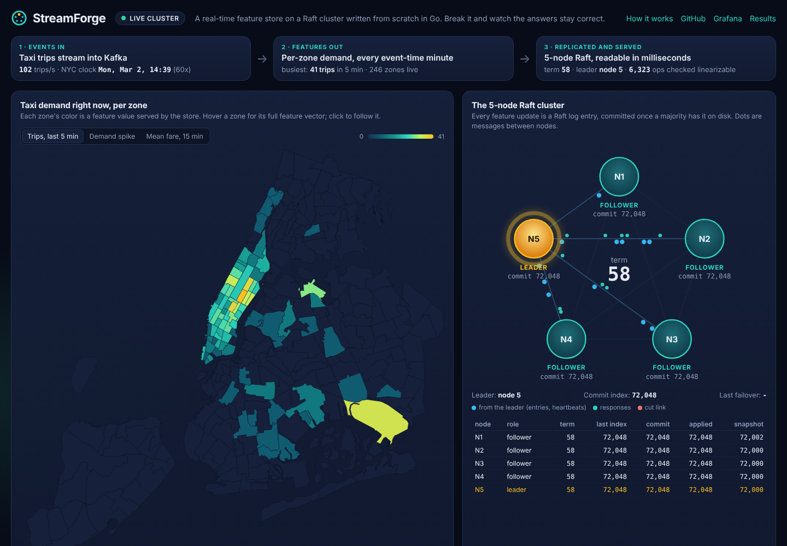
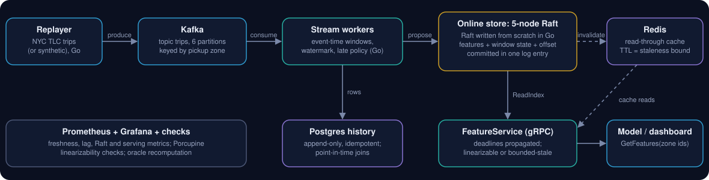

# StreamForge

**A real-time feature store whose online store is a 5-node Raft cluster written from scratch in Go, tested against crashes, pauses and network partitions.**

[](https://github.com/sohamb17/streamforge/actions/workflows/ci.yml)
&nbsp;**[Live demo →](https://sohamb17.github.io/streamforge/)** · [Walkthrough](docs/WALKTHROUGH.md) · [Measured results](bench/results/gate4/REPORT.md) · [Fault-injection results](bench/results/faults/SUMMARY.md)



NYC taxi trips stream into Kafka. Go stream workers turn them into per-zone features in event time
(trips in the last 5/30/60 minutes, mean fare and distance, a demand-spike ratio). Every batch of features is
committed to the Raft log **together with the Kafka offset and window state that produced it**, so crashes and
redelivery cannot double-count. A gRPC FeatureService serves the features in milliseconds, either linearizably
(Raft ReadIndex) or from a Redis cache that states its staleness bound. Every value is also kept in a
Postgres history for point-in-time-correct training data.

The demo page lets you **kill the leader, partition the network, freeze a node, crash the stream worker and
replay duplicates** while it checks, live, that client histories stay linearizable and that the served features
equal a from-scratch recomputation of the log. Without a live deployment, the page runs the same Go code compiled
to WebAssembly, on a simulated network in your browser.

## What was built, and the evidence

| Question | How it is answered | Evidence |
|---|---|---|
| Do feature values stay correct when processes crash, replay or race? | Offsets and window state commit atomically with outputs in one Raft entry; idempotent apply; deterministic windows | 0 oracle mismatches after repeated worker kills on 1M real trips; byte-identical state fingerprint on replay ([Gate 1](bench/results/gate1/)); duplicates ignored under injected redelivery ([faults](bench/results/faults/SUMMARY.md)) |
| Is the replicated store safe under failures? | Raft with PreVote, CheckQuorum, ReadIndex, snapshots, WAL with fsync | Porcupine-checked histories (55k to 69k ops each) linearizable under SIGKILLed and paused leaders and iptables partitions; a negative control is correctly rejected; 1,500 randomized simulated fault schedules; 4 of 4 re-injected classic Raft bugs caught ([raft-sim](bench/results/raft-sim/)) |
| Do training features match serving features? | One window implementation; integer sums; point-in-time join | 294,543 streaming history rows equal a backfill from offset 0; 300/300 online reads equal the point-in-time join ([Gate 3](bench/results/gate3/)) |
| Can the measurements be defended? | Open-loop load generator (no coordinated omission), histograms, stated hardware | [REPORT.md](bench/results/gate4/REPORT.md) |

Measured on one 2-vCPU machine with all 15 containers sharing it ([environment](bench/results/ENVIRONMENT.md)):

| | Result |
|---|---|
| Ingest, 10-minute run, consumer lag flat | **250,000 events/s** on ~1 CPU core (400,000/s in a 90 s ramp step) |
| Freshness at that rate (event published → features committed in Raft) | p50 34 ms, p99 63 ms |
| Raft writes, 5 nodes, fsync on majority, 32 closed-loop clients | 1,718 writes/s, p99 24.6 ms |
| Write unavailability after SIGKILL of the leader (5 runs) | median 381 ms (360 to 521 ms) |
| Linearizable GetFeatures (ReadIndex on the leader), open-loop 1,000 req/s | p50 3.6 ms, p99 13.2 ms, 0 errors |
| Cached GetFeatures (bounded staleness, 2 s TTL), open-loop 2,000 req/s | p99 21.6 ms, 0 errors (33.1 ms before request coalescing) |

Every number has its conditions in the report. The ingest rate is for a stream whose event time advances at wall-clock
speed; replaying the real month time-compressed stresses the commit path instead, and the report shows where that saturates.

## A model on top

`ml/` is a small consumer that shows the store doing its job end to end. `train.py` labels each zone-time from the
Postgres history ("will the next 15 minutes be more than 1.5x the zone's trailing-hour pace?"), builds the training set
with the point-in-time join (it asserts that no feature row comes from after its label time), and fits a logistic
regression, split by time. `score_online.py` then scores live zones from FeatureService through the same feature code.
On the full March 2026 month (582,152 examples, trained on March 1 to 22, tested on March 22 to 31) it reaches
ROC AUC 0.73 against 0.58 for the raw spike ratio alone ([report](ml/report.json)). It is a demonstration of
training/serving consistency, not a tuned model.

## Architecture



| Layer | Choice | Code |
|---|---|---|
| Event log | Kafka (KRaft), topic partitioned by pickup zone | `cmd/replayer`, `internal/tlc` |
| Stream processing | Go consumer group, event-time 1-minute buckets, 30 s watermark lateness, late events counted not merged | `internal/window`, `internal/worker` |
| Online store | **Raft written from scratch** (`internal/raft`: pure tick-driven core), WAL + snapshots, gRPC transport | `internal/raft`, `internal/raftnode`, `internal/store` |
| Serving | gRPC with deadlines; ReadIndex reads or Redis read-through cache with TTL bound and circuit breaker | `internal/serving`, `internal/cache` |
| Offline history | Postgres, idempotent upsert, point-in-time join | `internal/history` |
| Verification | Porcupine linearizability checks, deterministic simulation, oracle, parity, mutation testing | `internal/raftsim`, `internal/probe`, `cmd/verify`, `faults/` |
| Ops | Docker Compose, Prometheus histograms, Grafana, pprof | `deploy/compose` |
| Demo | React dashboard; live via Server-Sent Events or the Go code as WebAssembly | `web/`, `internal/console`, `internal/simdemo` |

## Run it locally

Requirements: Docker (Docker Desktop on Windows/macOS) and about 3 GB of free RAM.

```bash
git clone https://github.com/sohamb17/streamforge.git && cd streamforge
data/fetch.sh                                            # one month of NYC TLC trips (68 MB), checksum-verified
docker compose -f deploy/compose/docker-compose.yml up -d --build
```

Then open the dashboard at http://localhost:8080, Grafana at http://localhost:3000, and query a feature:

```bash
curl "http://localhost:8081/v1/features?zones=161,237"        # via the server container's JSON port, or:
grpcurl -plaintext -d '{"entity_ids":["161"]}' localhost:50051 streamforge.v1.FeatureService/GetFeatures
```

Development (Go 1.26, Node 22; or open the repo in the VS Code dev container):

```bash
go test ./...                    # unit, property and Raft simulation tests
make test-raft                   # 1,000 randomized fault schedules with Porcupine
make mutation                    # re-inserts classic Raft bugs; each must be caught
make faults                      # real faults on the running stack
make web-dev                     # dashboard dev server with the WebAssembly simulator
```

VS Code launch configurations for each component and the simulation tests are in `.vscode/`.

## Repository

```
cmd/           replayer, worker, storenode, server, console, verify, probe, loadgen, bench, simwasm
internal/      raft (core), raftnode (driver, WAL, transport), store (state machine), window, worker,
               serving, cache, history, oracle, raftsim (simulator), probe, linz (Porcupine model),
               console (dashboard backend), simdemo (in-browser engine)
proto/ gen/    gRPC contracts and generated code
deploy/        Docker Compose (local, production overlay with Caddy), Prometheus, Grafana, SQL
faults/        fault-injection scenarios        bench/  load generator scripts and all recorded results
web/           dashboard                         ml/     small scikit-learn consumer of the features
docs/          WALKTHROUGH.md (design and interview notes), DEPLOY.md
```

## Honest scope

- The Raft implementation is a learning and evidence choice. A production team would back an online store with
  etcd, DynamoDB or Cassandra. Membership is fixed at five nodes; there is no leadership transfer.
- Delivery is **at-least-once with idempotent application**, which gives effectively-once effects on the online
  store. It is not end-to-end exactly-once: the Postgres history and the cache sit outside the Raft entry
  (see the [walkthrough](docs/WALKTHROUGH.md#4-delivery-semantics-the-core-of-the-interview-story)).
- Cached reads are bounded-staleness, never linearizable.
- Numbers come from one shared 2-vCPU machine and say so; they are not production SLOs.

## Credits

Raft: Ongaro and Ousterhout, *In Search of an Understandable Consensus Algorithm*, and Ongaro's thesis (PreVote,
CheckQuorum, ReadIndex). The core follows the `Step`/`Ready` structure popularized by etcd's raft library;
it is an independent implementation, not derived from etcd's code. Linearizability checking: [Porcupine](https://github.com/anishathalye/porcupine) (MIT).
Trip data: [NYC Taxi & Limousine Commission](https://www.nyc.gov/site/tlc/about/tlc-trip-record-data.page),
March 2026 (see `data/MANIFEST.md`).
